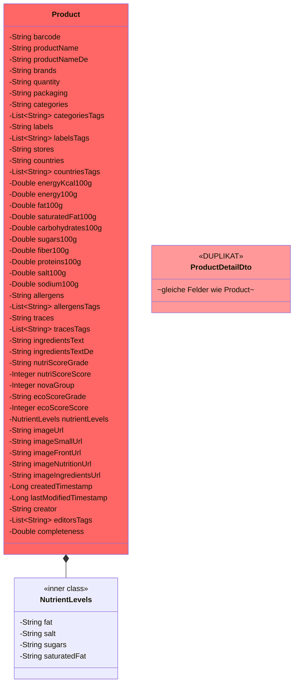
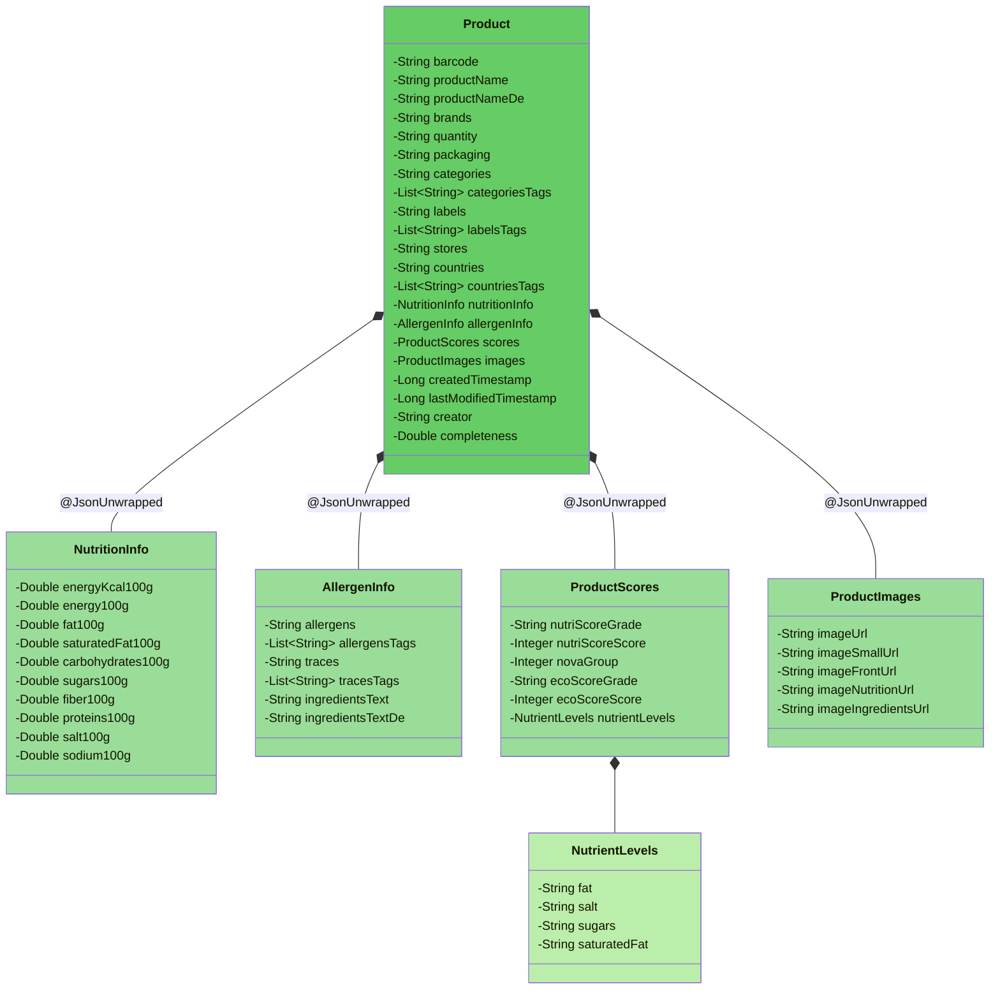

# Refactoring-Zielstruktur: Product.java

## Vorher (God Class)

**Probleme:** 40+ Felder, 7 verschiedene Concerns, innere Klasse, Duplikat-DTO

---

## Nachher (aufgeteilte Klassen)

**Vorteile:**
- Jede Klasse hat eine klare Verantwortlichkeit
- `Product.java` ist von ~250 auf ~80 Zeilen reduziert
- JSON-Struktur bleibt dank `@JsonUnwrapped` identisch
- `ProductDetailDto` ist ueberflüssig und geloescht
- Naehrwerte, Allergene, Scores und Bilder sind einzeln testbar und wiederverwendbar
